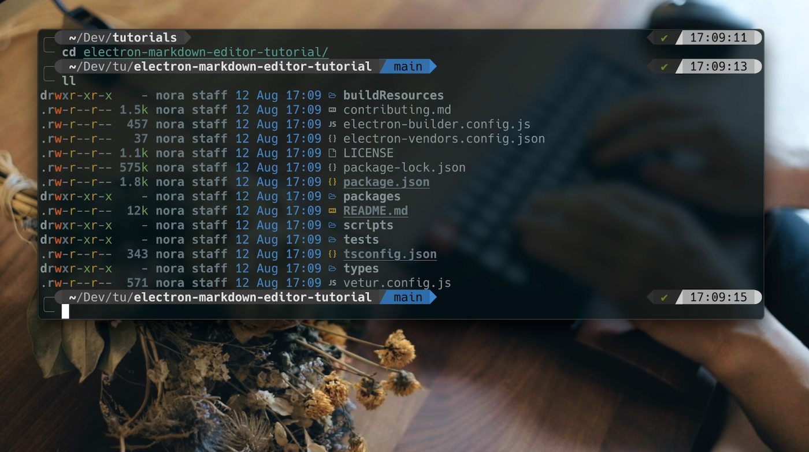
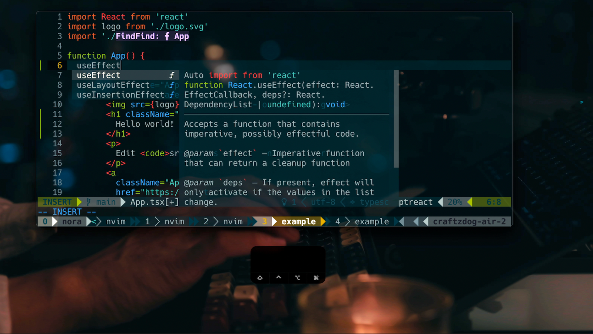
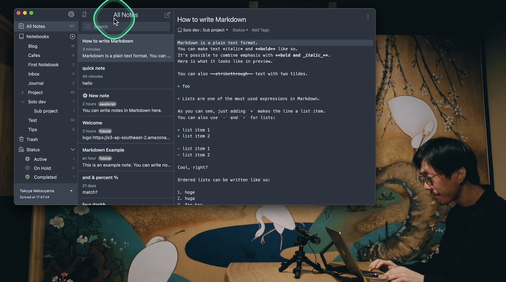

# Takuya's dotfiles

**Warning**: Don’t blindly use my settings unless you know what that entails. Use at your own risk!

### Looking for a Markdown note-taking app?

Check out my app called [Inkdrop](https://www.inkdrop.app/)

## Contents

- vim (Neovim) config
- tmux config
- git config
- fish config
- PowerShell config

## Neovim setup

### Requirements

- Neovim >= **0.9.0** (needs to be built with **LuaJIT**)
- Git >= **2.19.0** (for partial clones support)
- [LazyVim](https://www.lazyvim.org/)
- a [Nerd Font](https://www.nerdfonts.com/)(v3.0 or greater) **_(optional, but needed to display some icons)_**
- [lazygit](https://github.com/jesseduffield/lazygit) **_(optional)_**
- a **C** compiler for `nvim-treesitter`. See [here](https://github.com/nvim-treesitter/nvim-treesitter#requirements)
- for [telescope.nvim](https://github.com/nvim-telescope/telescope.nvim) **_(optional)_**
  - **live grep**: [ripgrep](https://github.com/BurntSushi/ripgrep)
  - **find files**: [fd](https://github.com/sharkdp/fd)
- a terminal that support true color and *undercurl*:
  - [kitty](https://github.com/kovidgoyal/kitty) **_(Linux & Macos)_**
  - [wezterm](https://github.com/wez/wezterm) **_(Linux, Macos & Windows)_**
  - [alacritty](https://github.com/alacritty/alacritty) **_(Linux, Macos & Windows)_**
  - [iterm2](https://iterm2.com/) **_(Macos)_**
- [Solarized Osaka](https://github.com/craftzdog/solarized-osaka.nvim)

## Shell setup (macOS & Linux)

- [Fish shell](https://fishshell.com/)
- [Fisher](https://github.com/jorgebucaran/fisher) - Plugin manager
- [Tide](https://github.com/IlanCosman/tide) - Shell theme. Use version 5: `fisher install ilancosman/tide@v5`
- [Nerd fonts](https://github.com/ryanoasis/nerd-fonts) - Powerline-patched fonts. I use Hack.
- [z for fish](https://github.com/jethrokuan/z) - Directory jumping
- [Eza](https://github.com/eza-community/eza) - `ls` replacement
- [ghq](https://github.com/x-motemen/ghq) - Local Git repository organizer
- [fzf](https://github.com/PatrickF1/fzf.fish) - Interactive filtering

## PowerShell setup (Windows)

- [Scoop](https://scoop.sh/) - A command-line installer
- [Git for Windows](https://gitforwindows.org/)
- [Oh My Posh](https://ohmyposh.dev/) - Prompt theme engine
- [Terminal Icons](https://github.com/devblackops/Terminal-Icons) - Folder and file icons
- [PSReadLine](https://docs.microsoft.com/en-us/powershell/module/psreadline/) - Cmdlets for customizing the editing environment, used for autocompletion
- [z](https://www.powershellgallery.com/packages/z) - Directory jumper
- [PSFzf](https://github.com/kelleyma49/PSFzf) - Fuzzy finder

## How to use

Watch my video tutorials:

1. [My Neovim setup](https://www.youtube.com/watch?v=fFHlfbKVi30)
   - [Article version](https://www.devas.life/effective-neovim-setup-for-web-development-towards-2024/)
1. [My dev workflow using tmux and vim](https://www.youtube.com/watch?v=sSOfr2MtRU8&list=PLxQA0uNgQDCICMRwlOzWAZBPL05XBC_br&index=10)
1. [A productive command-line Git workflow for indie app developers](https://www.youtube.com/watch?v=qKpY7t5m35k&list=PLxQA0uNgQDCICMRwlOzWAZBPL05XBC_br&index=4)
   - [Blogpost](https://dev.to/craftzdog/a-productive-command-line-git-workflow-for-indie-app-developers-k7d)
1. [My Fish shell workflow for coding](https://www.youtube.com/watch?v=KKxhf50FIPI)
1. [How to set up PowerShell prompt with Oh My Posh on Windows 11](https://www.youtube.com/watch?v=5-aK2_WwrmM)

## About me

- [@inkdrop_app on X](https://twitter.com/inkdrop_app)
- [Newsletters](https://www.devas.life/)
- [My product: Inkdrop - Markdown note-taking app](https://www.inkdrop.app/)
