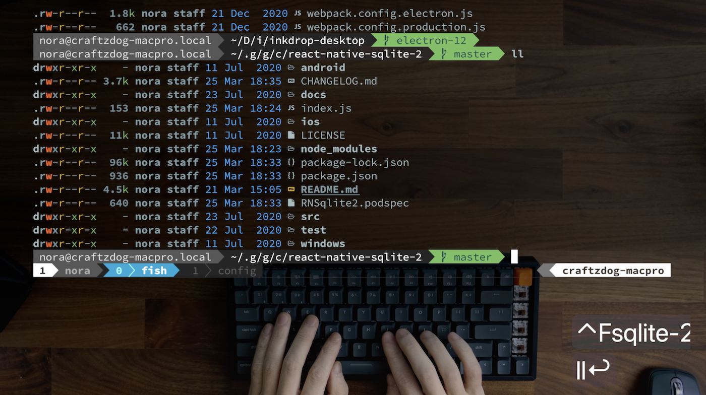

# Takuya's dotfiles

**Warning**: Don’t blindly use my settings unless you know what that entails. Use at your own risk!

## Sponsor

Inkdrop - A cross-platform Markdown note-taking app

## Contents

- vim (NeoVim) config
  - Plugins are managed with [dein.vim](https://github.com/Shougo/dein.vim)
- tmux config
- git config
- fish config

## Vim setup

Requires Neovim (>= 0.5)

- [vim-plug](https://github.com/junegunn/vim-plug) - A minimalist Vim plugin manager
- [nvim-lspconfig](https://github.com/neovim/nvim-lspconfig) - A collection of configurations for Neovim's built-in LSP
- [nvim-treesitter](https://github.com/nvim-treesitter/nvim-treesitter) - [Treesitter](https://github.com/tree-sitter/tree-sitter) configurations and abstraction layer for Neovim
- [completion-nvim](https://github.com/nvim-lua/completion-nvim) - An auto completion framework based on Neovim's built-in LSP
- [glepnir/lspsaga.nvim](https://github.com/glepnir/lspsaga.nvim) - A light-weight LSP plugin based on Neovim built-in LSP with highly a performant UI
- [telescope.nvim](https://github.com/nvim-telescope/telescope.nvim) - A highly extendable fuzzy finder over lists

## Shell setup

- [Fish shell](https://fishshell.com/)
- [Fisher](https://github.com/jorgebucaran/fisher) - Plugin manager
- [Tide](https://github.com/IlanCosman/tide) - Shell theme
- [Nerd fonts](https://github.com/ryanoasis/nerd-fonts) - Powerline-patched fonts. I use Hack.
- [z for fish](https://github.com/jethrokuan/z) - Directory jumping
- [Exa](https://the.exa.website/) - `ls` replacement
- [ghq](https://github.com/x-motemen/ghq) - Local Git repository organizer
- [peco](https://github.com/peco/peco) - Interactive filtering

## How to use

Watch my video tutorials:

1. [My dev workflow using tmux and vim](https://www.youtube.com/watch?v=sSOfr2MtRU8&list=PLxQA0uNgQDCICMRwlOzWAZBPL05XBC_br&index=10)
2. [My vim setup to speed up JavaScript coding for my Electron and React Native apps](https://www.youtube.com/watch?v=UZBjt04y4Oo&list=PLxQA0uNgQDCICMRwlOzWAZBPL05XBC_br&index=3)
   - [Blogpost](https://dev.to/craftzdog/my-vim-setup-to-speed-up-javascript-coding-for-my-electron-and-react-native-apps-4ebp)
3. [A productive command-line Git workflow for indie app developers](https://www.youtube.com/watch?v=qKpY7t5m35k&list=PLxQA0uNgQDCICMRwlOzWAZBPL05XBC_br&index=4)
   - [Blogpost](https://dev.to/craftzdog/a-productive-command-line-git-workflow-for-indie-app-developers-k7d)
4. [My Fish shell workflow for coding](https://www.youtube.com/watch?v=KKxhf50FIPI)

## About me

- [Twitter @inkdrop_app](https://twitter.com/inkdrop_app)
- [Blog](https://blog.inkdrop.app/)
- [My product: Inkdrop - Markdown note-taking app](https://www.inkdrop.app/)
