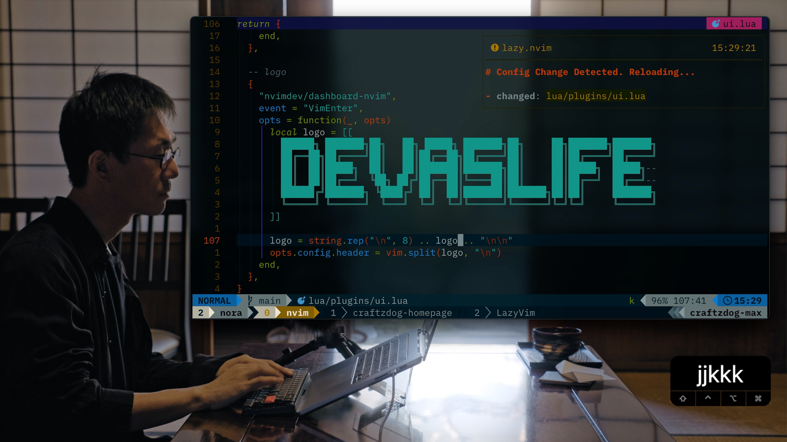

# My dotfiles

This is the repo to store all my dotfiles and personal configs. It is forked and modified from [Takuya's dotfiles](https://github.com/craftzdog/dotfiles-public). 

## Contents

- vim (Neovim) config
- tmux config
- git config
- zsh config
- PowerShell config

## Neovim setup

### Requirements

- Neovim >= **0.9.0** (needs to be built with **LuaJIT**)
- Git >= **2.19.0** (for partial clones support)
- [LazyVim](https://www.lazyvim.org/)
- a [Nerd Font](https://www.nerdfonts.com/)(v3.0 or greater) **_(optional, but needed to display some icons)_**
- [lazygit](https://github.com/jesseduffield/lazygit) **_(optional)_**
- a **C** compiler for `nvim-treesitter`. See [here](https://github.com/nvim-treesitter/nvim-treesitter#requirements)
- for [telescope.nvim](https://github.com/nvim-telescope/telescope.nvim) **_(optional)_**
  - **live grep**: [ripgrep](https://github.com/BurntSushi/ripgrep)
  - **find files**: [fd](https://github.com/sharkdp/fd)
- a terminal that support true color and *undercurl*:
  - [kitty](https://github.com/kovidgoyal/kitty) **_(Linux & Macos)_**
  - [wezterm](https://github.com/wez/wezterm) **_(Linux, Macos & Windows)_**
  - [alacritty](https://github.com/alacritty/alacritty) **_(Linux, Macos & Windows)_**
  - [iterm2](https://iterm2.com/) **_(Macos)_**
- [Solarized Osaka](https://github.com/craftzdog/solarized-osaka.nvim)

## Shell setup (Linux & macOS & Windows)

- [Starship](https://starship.rs) - The minimal, blazing-fast, and infinitely customizable prompt for any shell
- [Nerd fonts](https://github.com/ryanoasis/nerd-fonts) - Powerline-patched fonts. I use [JetBrains Mono](https://github.com/ryanoasis/nerd-fonts/tree/master/patched-fonts/JetBrainsMono)
- [Zoxide](https://github.com/ajeetdsouza/zoxide) -  A smarter `cd` command, inspired by `z` and `autojump`
- [Fzf](https://github.com/junegunn/fzf) - A general-purpose command-line fuzzy finde
- [Delta](https://github.com/dandavison/delta) - A syntax-highlighting pager for git, diff, and grep output 
- [Ghq](https://github.com/x-motemen/ghq) - Local git repository organizer
- [Peco](https://github.com/peco/peco) - Interactive filtering

### For Linux & macOS

- [Alacritty](https://alacritty.org) - A fast, cross-platform, OpenGL terminal emulator
- [Zsh shell](https://zsh.sourceforge.io) - A shell designed for interactive use
- [Oh my zsh](https://ohmyz.sh) - An open source, community-driven framework for managing your zsh configuration
- [Exa](https://the.exa.website/) - A modern `ls` replacement

### For PowerShell on Windows

- [Winget](https://github.com/microsoft/winget-cli) - Windows Package Manager Client
- [Scoop](https://scoop.sh/) - A command-line installer
- [Terminal Icons](https://github.com/devblackops/Terminal-Icons) - Folder and file icons
- [Git for Windows](https://gitforwindows.org/) - Git for Windows
- [PSFzf](https://github.com/kelleyma49/PSFzf) - Fuzzy finder
- [PSReadLine](https://docs.microsoft.com/en-us/powershell/module/psreadline/) - Cmdlets for customizing the editing environment, used for autocompletion

<!-- ## How to use

Watch Takuya's video tutorials:

1. [My Neovim setup](https://www.youtube.com/watch?v=fFHlfbKVi30)
   - [Article version](https://www.devas.life/effective-neovim-setup-for-web-development-towards-2024/)
1. [My dev workflow using tmux and vim](https://www.youtube.com/watch?v=sSOfr2MtRU8&list=PLxQA0uNgQDCICMRwlOzWAZBPL05XBC_br&index=10)
1. [A productive command-line Git workflow for indie app developers](https://www.youtube.com/watch?v=qKpY7t5m35k&list=PLxQA0uNgQDCICMRwlOzWAZBPL05XBC_br&index=4)
   - [Blogpost](https://dev.to/craftzdog/a-productive-command-line-git-workflow-for-indie-app-developers-k7d)
4. [My Fish shell workflow for coding](https://www.youtube.com/watch?v=KKxhf50FIPI)
5. [How to set up PowerShell prompt with Oh My Posh on Windows 11](https://www.youtube.com/watch?v=5-aK2_WwrmM) -->
